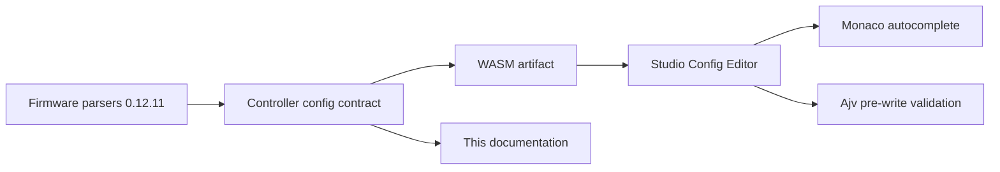

The authoritative JSON Schema is not hard-coded in Studio. During a WASM
build, firmware embeds the complete Controller config contract and exposes it
through `getControllerConfigContractJson()`.

## Version changes

After another WASM is activated, Studio reads the contract again, re-registers
the schema for the Controller Config Editor model and recompiles its validator.
Autocomplete and accepted keywords therefore follow the active WASM artifact,
not the Studio release.

## Fail-closed behavior

Config writes are disabled when:

- the WASM contract is missing or has an unsupported version,
- JSON cannot be parsed,
- a value does not match the JSON Schema,
- a cross-section rule fails, such as multiple I2C entries, an unknown I/O
  label in a segment or a reversed DALI temperature range.

Reading config, history, copying and exporting remain available.

## Machine-readable files

- [Complete 0.12.11 contract](/assets/docs/controller-config/0.12.11/controller-config.contract.json)
- [0.12.11 JSON Schema](/assets/docs/controller-config/0.12.11/controller-config.schema.json)

_Generated from the versioned `Spectoda/firmware` contract for FW 0.12.11. Do not maintain these tables separately from the firmware contract._
