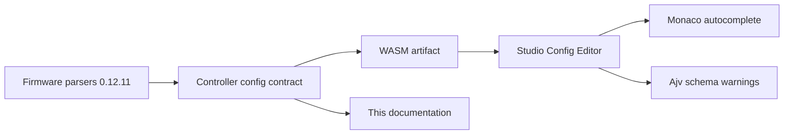

The authoritative JSON Schema is not hard-coded in Studio. During a WASM
build, firmware embeds the complete Controller config contract and exposes it
through `getControllerConfigContractJson()`.

## Version changes

After another WASM is activated, Studio reads the contract again, re-registers
the schema for the Controller Config Editor model and recompiles its validator.
Autocomplete and accepted keywords therefore follow the active WASM artifact,
not the Studio release.

## Writes and warnings

A config write is disabled only when JSON cannot be parsed or the top-level
value is not an object. A missing or incompatible WASM contract shows an
`unvalidated` state. A JSON Schema or cross-section mismatch produces a
warning while leaving writes available. Examples include an unknown keyword,
multiple I2C entries, an I/O referenced by a segment but not defined in the
Controller config, or a reversed DALI temperature range. The contract can also
attach versioned remediation guidance,
for example renaming `fade` to `fadetime` or moving segment `brightness` to the
referenced I/O object. A long segment label is likewise warning-only; firmware
uses its first five characters.

## Machine-readable files

- [Complete 0.12.11 contract](/assets/docs/controller-config/0.12.11/controller-config.contract.json)
- [0.12.11 JSON Schema](/assets/docs/controller-config/0.12.11/controller-config.schema.json)

_Generated from the versioned `Spectoda/firmware` contract for FW 0.12.11. Do not maintain these tables separately from the firmware contract._
